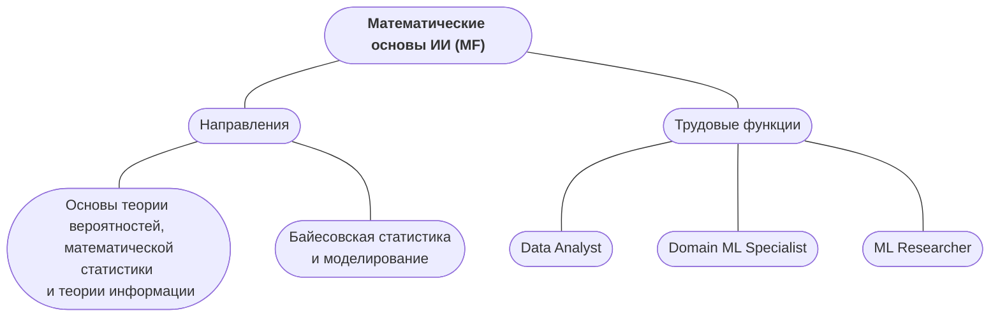

# Competence-Bank
## Математика

```mermaid
graph TD;
classDef areaMathStyle fill:#CCFFFF,stroke:#333,stroke-width:1px
classDef areasMath fill:#66FFFF,stroke:#333,stroke-width:1px
classDef jobsMath fill:#99CCFF,stroke:#333,stroke-width:1px
classDef aspectMathStyle fill:#3BE0EC,stroke:#333,stroke-width:1px
classDef jobsMathStyle fill:#66B2FF,stroke:#333,stroke-width:1px

AreaMath(["`**Математические основы ИИ (MF)**`"]):::areaMathStyle -->apectsMath(["Направления"]):::areasMath
apectsMath -->MathAspect1(["Основы теории вероятностей, <br> математической статистики <br> и теории информации"]):::aspectMathStyle
apectsMath -->MathAspect2(["Байесовская статистика <br> и моделирование"]):::aspectMathStyle
apectsMath -->MathAspect3(["Численные методы"]):::aspectMathStyle
apectsMath -->MathAspect4(["Статистические основы МО"]):::aspectMathStyle
apectsMath -->MathAspect5(["Дополнительные главы <br> математической теории ИИ"]):::aspectMathStyle

AreaMath -->jobsMath(["Трудовые функции"]):::jobsMath
jobsMath -->MathJobsDataAnalyst(["Data Analyst"]):::jobsMathStyle
jobsMath -->MathJobsDomainMLSpecialist(["Domain ML Specialist"]):::jobsMathStyle
jobsMath -->MathJobsMLResearcher(["ML Researcher"]):::jobsMathStyle

click MathAspect1 "https://github.com/VoidSubjucator/Competence-Bank/blob/main/Math/AIMathBasics/MathAspect1.md"
click MathAspect2 "https://github.com/VoidSubjucator/Competence-Bank/blob/main/Math/AIMathBasics/MathAspect2.md"
click MathAspect3 "https://github.com/VoidSubjucator/Competence-Bank/blob/main/Math/AIMathBasics/MathAspect3.md"
click MathAspect4 "https://github.com/VoidSubjucator/Competence-Bank/blob/main/Math/AIMathBasics/MathAspect4.md"
click MathAspect5 "https://github.com/VoidSubjucator/Competence-Bank/blob/main/Math/AIMathBasics/MathAspect5.md"

click MathJobsDataAnalyst "https://github.com/VoidSubjucator/Competence-Bank/blob/main/Math/AIMathBasics/DataAnalyst.md"
click MathJobsDomainMLSpecialist "https://github.com/VoidSubjucator/Competence-Bank/blob/main/Math/AIMathBasics/DomainMLSpecialist.md"
click MathJobsMLResearcher "https://github.com/VoidSubjucator/Competence-Bank/blob/main/Math/AIMathBasics/MLResearcher.md"
```

```mermaid
graph TD;
classDef areaDataEngineeringStyle fill:#FFFF33,stroke:#333,stroke-width:1px
classDef aspectDataEngineeringStyle fill:#3BE0EC,stroke:#333,stroke-width:1px
classDef jobsDataEngineeringStyle fill:#66B2FF,stroke:#333,stroke-width:1px

AreaMath(["`**Математические основы ИИ (MF)**`"]):::areaMathStyle ---apectsMath(["Направления"]):::areasMath
apectsMath ---MathAspect1(["Основы теории вероятностей, <br> математической статистики <br> и теории информации"]):::aspectMathStyle
apectsMath ---MathAspect2(["Байесовская статистика <br> и моделирование"]):::aspectMathStyle

AreaMath ---jobsMath(["Трудовые функции"]):::jobsMath
jobsMath ---MathJobsDataAnalyst(["Data Analyst"]):::jobsMathStyle
jobsMath ---MathJobsDomainMLSpecialist(["Domain ML Specialist"]):::jobsMathStyle
jobsMath ---MathJobsMLResearcher(["ML Researcher"]):::jobsMathStyle

click MathJobsDataAnalyst "https://github.com/VoidSubjucator/Competence-Bank/blob/main/Math/AIMathBasics/DataAnalyst.md"
click MathJobsDomainMLSpecialist "https://github.com/VoidSubjucator/Competence-Bank/blob/main/Math/AIMathBasics/DomainMLSpecialist.md"
click MathJobsMLResearcher "https://github.com/VoidSubjucator/Competence-Bank/blob/main/Math/AIMathBasics/MLResearcher.md"
```

## Разработка

