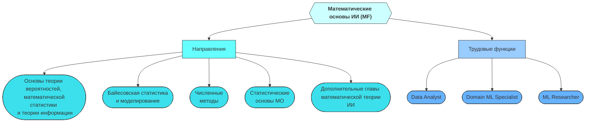
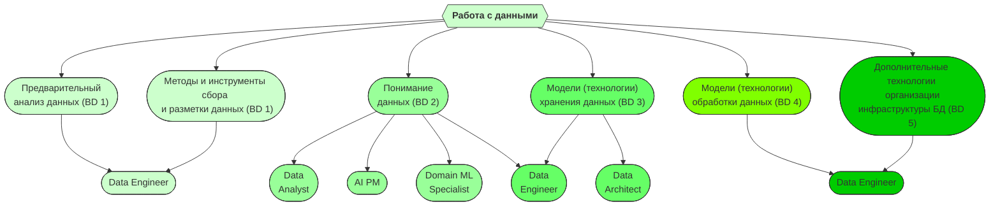
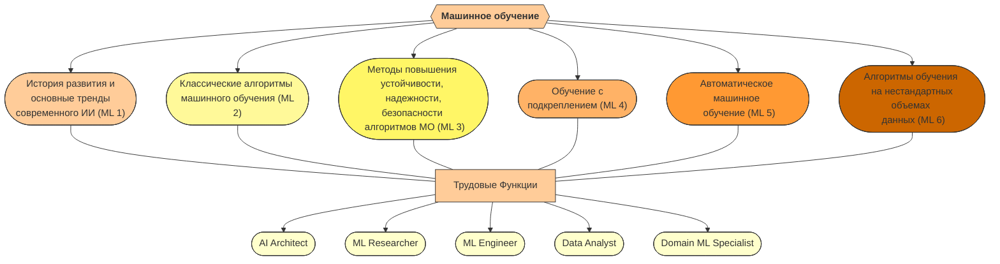

# Банк Компетенций
## Математика

```mermaid
graph TD;
classDef areaMathStyle fill:#CCFFFF,stroke:#333,stroke-width:1px
classDef areasMath fill:#66FFFF,stroke:#333,stroke-width:1px
classDef jobMath fill:#99CCFF,stroke:#333,stroke-width:1px
classDef aspectMathStyle fill:#3BE0EC,stroke:#333,stroke-width:1px
classDef jobMathStyle fill:#66B2FF,stroke:#333,stroke-width:1px

AreaMath{{"`**Математические основы ИИ (MF)**`"}}:::areaMathStyle -->apectsMath["Направления"]:::areasMath
apectsMath -->aspectProbabilityStatistics(["Основы теории вероятностей, <br> математической статистики <br> и теории информации"]):::aspectMathStyle
apectsMath -->aspectBayesStatistics(["Байесовская статистика <br> и моделирование"]):::aspectMathStyle
apectsMath -->aspectNumericMethods(["Численные <br> методы"]):::aspectMathStyle
apectsMath -->aspectMLStatistics(["Статистические <br> основы МО"]):::aspectMathStyle
apectsMath -->aspectAdditionalAIMath(["Дополнительные главы <br> математической теории ИИ"]):::aspectMathStyle

AreaMath -->jobsMath["Трудовые функции"]:::jobMath
jobsMath -->MathJobDataAnalyst(["Data Analyst"]):::jobMathStyle
jobsMath -->MathJobDomainMLSpecialist(["Domain ML Specialist"]):::jobMathStyle
jobsMath -->MathJobMLResearcher(["ML Researcher"]):::jobMathStyle

click aspectProbabilityStatistics "https://github.com/VoidSubjucator/Competence-Bank/blob/main/Math/AIMathBasics/aspectProbabilityStatistics.md"
click aspectBayesStatistics "https://github.com/VoidSubjucator/Competence-Bank/blob/main/Math/AIMathBasics/aspectBayesStatistics.md"
click aspectNumericMethods "https://github.com/VoidSubjucator/Competence-Bank/blob/main/Math/AIMathBasics/aspectNumericMethods.md"
click aspectMLStatistics "https://github.com/VoidSubjucator/Competence-Bank/blob/main/Math/AIMathBasics/aspectMLStatistics.md"
click aspectAdditionalAIMath "https://github.com/VoidSubjucator/Competence-Bank/blob/main/Math/AIMathBasics/aspectAdditionalAIMath.md"

click MathJobDataAnalyst "https://github.com/VoidSubjucator/Competence-Bank/blob/main/Jobs/jobDataAnalyst.md" _blank
click MathJobDomainMLSpecialist "https://github.com/VoidSubjucator/Competence-Bank/blob/main/Jobs/jobDomainMLSpecialist.md" _blank
click MathJobMLResearcher "https://github.com/VoidSubjucator/Competence-Bank/blob/main/Jobs/jobMLResearcher.md" _blank
```

```mermaid
graph TD;
classDef BD1Style fill:#CCFFCC,stroke:#333,stroke-width:1px
classDef BD2Style fill:#99FF99,stroke:#333,stroke-width:1px
classDef BD3Style fill:#66FF66,stroke:#333,stroke-width:1px
classDef BD4Style fill:#80FF00,stroke:#333,stroke-width:1px
classDef BD5Style fill:#00CC00,stroke:#333,stroke-width:1px

areaBD{{"`**Работа с данными**`"}}:::BD1Style -->aspectPreDataAnalysis(["Предварительный <br> анализ данных (BD 1)"]):::BD1Style
areaBD -->aspectDataMarkCollection(["Методы и инструменты сбора <br> и разметки данных (BD 1)"]):::BD1Style
areaBD -->aspectDataUnderstanding(["Понимание <br> данных (BD 2)"]):::BD2Style
areaBD -->aspectDataStoraging(["Модели (технологии) <br> хранения данных (BD 3)"]):::BD3Style
areaBD -->aspectDataProcessing(["Модели (технологии) <br> обработки данных (BD 4)"]):::BD4Style
areaBD -->aspectBDInfrastructure(["Дополнительные технологии <br> организации инфраструктуры БД (BD 5)"]):::BD5Style

aspectPreDataAnalysis -->jobDataEngineer(["Data Engineer"]):::BD1Style
aspectDataMarkCollection -->jobDataEngineer

aspectDataUnderstanding -->jobDataAnalyst(["Data <br> Analyst"]):::BD2Style
aspectDataUnderstanding -->jobAIPM(["AI PM"]):::BD2Style
aspectDataUnderstanding -->jobDomainMLSpecialist(["Domain ML <br> Specialist"]):::BD2Style

aspectDataUnderstanding -->jobDataEngineer3(["Data <br> Engineer"]):::BD3Style
aspectDataStoraging -->jobDataArchitect(["Data <br> Architect"]):::BD3Style
aspectDataStoraging -->jobDataEngineer3(["Data <br> Engineer"]):::BD3Style

aspectDataProcessing -->jobDataEngineer4(["Data Engineer"]):::BD5Style
aspectBDInfrastructure -->jobDataEngineer4

click aspectPreDataAnalysis "https://github.com/VoidSubjucator/Competence-Bank/blob/main/Math/BD/aspectPreDataAnalysis.md"
click aspectDataMarkCollection "https://github.com/VoidSubjucator/Competence-Bank/blob/main/Math/BD/aspectDataMarkCollection.md"
click aspectDataUnderstanding "https://github.com/VoidSubjucator/Competence-Bank/blob/main/Math/BD/aspectDataUnderstanding.md"
click aspectDataStoraging "https://github.com/VoidSubjucator/Competence-Bank/blob/main/Math/BD/aspectDataStoraging.md"
click aspectDataProcessing "https://github.com/VoidSubjucator/Competence-Bank/blob/main/Math/BD/aspectDataProcessing.md"
click aspectBDInfrastructure "https://github.com/VoidSubjucator/Competence-Bank/blob/main/Math/BD/aspectBDInfrastructure.md"

click jobDataEngineer "https://github.com/VoidSubjucator/Competence-Bank/blob/main/Jobs/jobDataEngineer.md"
click jobDataEngineer3 "https://github.com/VoidSubjucator/Competence-Bank/blob/main/Jobs/jobDataEngineer.md"
click jobDataEngineer4 "https://github.com/VoidSubjucator/Competence-Bank/blob/main/Jobs/jobDataEngineer.md"

click jobDataAnalyst "https://github.com/VoidSubjucator/Competence-Bank/blob/main/Jobs/jobDataAnalyst.md"
click jobAIPM "https://github.com/VoidSubjucator/Competence-Bank/blob/main/Jobs/jobAIPM.md"
click jobDomainMLSpecialist "https://github.com/VoidSubjucator/Competence-Bank/blob/main/Jobs/jobDomainMLSpecialist.md"

click jobDataArchitect "https://github.com/VoidSubjucator/Competence-Bank/blob/main/Jobs/jobDataArchitect.md"
```

```mermaid
graph TD;
classDef ML1Style fill:#FFCC99,stroke:#333,stroke-width:1px
classDef ML2Style fill:#FFF999,stroke:#333,stroke-width:1px
classDef ML3Style fill:#FFF666,stroke:#333,stroke-width:1px
classDef ML4Style fill:#FFB266,stroke:#333,stroke-width:1px
classDef ML5Style fill:#FF9933,stroke:#333,stroke-width:1px
classDef ML6Style fill:#CC6600,stroke:#333,stroke-width:1px
classDef MLJobStyle fill:#FFFFCC,stroke:#333,stroke-width:1px

areaML{{"`**Машинное обучение**`"}}:::ML1Style -->aspectHistoryTrends(["История развития и <br> основные тренды <br> современного ИИ (ML 1)"]):::ML1Style
areaML -->aspectClassicAlgo(["Классические алгоритмы <br> машинного обучения (ML 2)"]):::ML2Style
areaML -->aspectMLStability(["Методы повышения устойчивости, <br> надежности, безопасности <br> алгоритмов МО (ML 3)"]):::ML3Style
areaML -->aspectReinforcementLearning(["Обучение с <br> подкреплением (ML 4)"]):::ML4Style
areaML -->aspectAutoML(["Автоматическое машинное <br> обучение (ML 5)"]):::ML5Style
areaML -->aspectNonStandardLearningAlgo(["Алгоритмы обучения <br> на нестандартных объемах <br> данных (ML 6)"]):::ML6Style

aspectHistoryTrends ---jobsHeaderML["Трудовые Функции"]:::ML1Style
aspectClassicAlgo ---jobsHeaderML
aspectMLStability ---jobsHeaderML
aspectReinforcementLearning ---jobsHeaderML
aspectAutoML ---jobsHeaderML
aspectNonStandardLearningAlgo ---jobsHeaderML

jobsHeaderML -->jobAIArchitect(["AI Architect"]):::MLJobStyle
jobsHeaderML -->jobMLResearcher(["ML Researcher"]):::MLJobStyle
jobsHeaderML -->jobMLEngineer(["ML Engineer"]):::MLJobStyle
jobsHeaderML -->jobDataAnalyst(["Data Analyst"]):::MLJobStyle
jobsHeaderML -->jobDomainMLSpecialist(["Domain ML Specialist"]):::MLJobStyle

click aspectHistoryTrends "https://github.com/VoidSubjucator/Competence-Bank/blob/main/Math/ML/aspectHistoryTrends.md"
click aspectClassicAlgo "https://github.com/VoidSubjucator/Competence-Bank/blob/main/Math/ML/aspectClassicAlgo.md"
click aspectMLStability "https://github.com/VoidSubjucator/Competence-Bank/blob/main/Math/ML/aspectMLStability.md"
click aspectReinforcementLearning "https://github.com/VoidSubjucator/Competence-Bank/blob/main/Math/ML/aspectReinforcementLearning.md"
click aspectAutoML "https://github.com/VoidSubjucator/Competence-Bank/blob/main/Math/ML/aspectAutoML.md"
click aspectNonStandardLearningAlgo "https://github.com/VoidSubjucator/Competence-Bank/blob/main/Math/ML/aspectNonStandardLearningAlgo.md"

click jobAIArchitect "https://github.com/VoidSubjucator/Competence-Bank/blob/main/Jobs/jobAIArchitect.md"
click jobMLResearcher "https://github.com/VoidSubjucator/Competence-Bank/blob/main/Jobs/jobMLResearcher.md"
click jobMLEngineer "https://github.com/VoidSubjucator/Competence-Bank/blob/main/Jobs/jobMLEngineer.md"
click jobDataAnalyst "https://github.com/VoidSubjucator/Competence-Bank/blob/main/Jobs/jobDataAnalyst.md"
click jobDomainMLSpecialist "https://github.com/VoidSubjucator/Competence-Bank/blob/main/Jobs/jobDomainMLSpecialist.md"
```

## Разработка

