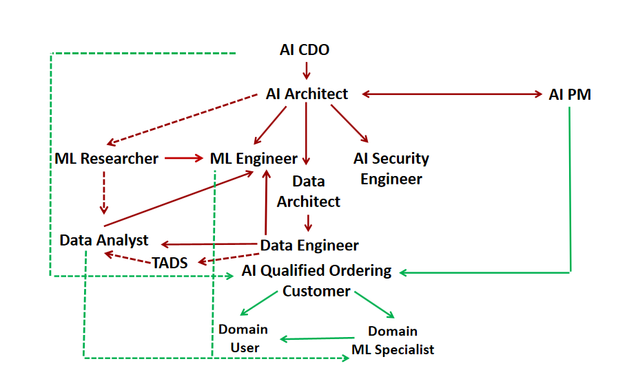

# Компетенции в области ИИ

Этот репозиторий создан для хранения профессиональной ролевой модели компетенций,
которые могут быть полезны при создании образовательных программ в области ИИ.

Все материалы доступны под лицензией BSD-3.

## Профессиональная ролевая модель

## Доступные материалы
* Профессиональные роли - [**подробно**](./RolesCompetencies.md);
* Профессиональные роли - [**наглядно**](./ProfessionsСlearly.md);
* Александра Климова: Принципы разработки компетентностной модели в сфере ИИ - [**презентация**](./Extra/принципы_разработки_компетентностной_модели_в_сфере_ИИ.pdf);
* Александр Бухановский: Искусственный интеллект как объект обучения - [**презентация**](./Extra/Искусственный_интеллект_как_объект_обучения.pdf);
* Владимир Васильев: Переход к категорийно-ролевой компетентностной модели - [**презентация**](./Extra/Переход к категорийно-ролевой компетентностной модели.pdf).

## Граф компетентностной модели

Граф компетентностной модели отражает структуру связей между основными понятиями и дисциплинами, 
необходимыми для освоения  [профессиональных ролей](./Img/role_model.png) в сфере ИИ. 
Каждая терминальная вершина графа содержит наименование тематического направления. 

При выборе направления осуществляется переход к странице, содержащей: 
- формулировку компетенции;
- индикаторы освоения компетенции;
- сущности компетенции, определяющие ключевые темы в рамках образовательных дисциплин(ы).

Сущности определяют рекомендуемое минимально-необходимое покрытие всех профессиональных компетенций, но не отражают полное содержание образовательных дисциплин (в т.ч. базовые умения).
В табличной форме компетентностная модель представлена [здесь](./Extra/competence_bank.xlsx).

В случае проблем с отображением интерактивной версии графа, 
вы можете использовать [статичный вариант](./Extra/itmo-ai_competence-bank.pdf).

```mermaid
graph LR;
classDef DomainStyle fill:#E0E0E0,stroke:#333,stroke-width:2px

classDef MathStyle fill:#CCFFFF,stroke:#333,stroke-width:1px
classDef BDStyle fill:#CCFFCC,stroke:#333,stroke-width:1px
classDef MLStyle fill:#FFCC99,stroke:#333,stroke-width:1px
classDef DLStyle fill:#FDE406,stroke:#333,stroke-width:1px
classDef OtherStyle fill:#FF9999,stroke:#333,stroke-width:1px

classDef PLStyle fill:#FF99CC,stroke:#333,stroke-width:1px
classDef LCStyle fill:#99CCFF,stroke:#333,stroke-width:1px
classDef AISStyle fill:#CC99FF,stroke:#333,stroke-width:1px

classDef WhiteSpace fill:#FFFFFF,stroke:#FFFFFF,stroke-width:1px

whiteSpace1[ ]:::WhiteSpace

aspectProbabilityStatistics([<a href='https://github.com/itmo-ai/Competence-Bank/blob/main/Math/AIMathBasics/aspectProbabilityStatistics.md'>Основы теории вероятностей, математической статистики и теории информации</a>]):::MathStyle ---areaMath["`**Математические основы ИИ (MF 1)**`"]:::MathStyle
aspectBayesStatistics([<a href='https://github.com/itmo-ai/Competence-Bank/blob/main/Math/AIMathBasics/aspectBayesStatistics.md'>Байесовская статистика и моделирование</a>]):::MathStyle ---areaMath
aspectNumericMethods([<a href='https://github.com/itmo-ai/Competence-Bank/blob/main/Math/AIMathBasics/aspectNumericMethods.md'>Численные методы</a>]):::MathStyle ---areaMath
aspectMLStatistics([<a href='https://github.com/itmo-ai/Competence-Bank/blob/main/Math/AIMathBasics/aspectMLStatistics.md'>Статистические основы МО</a>]):::MathStyle ---areaMath
aspectAdditionalAIMath([<a href='https://github.com/itmo-ai/Competence-Bank/blob/main/Math/AIMathBasics/aspectAdditionalAIMath.md'>Дополнительные главы математической теории ИИ</a>]):::MathStyle ---areaMath

aspectPreDataAnalysis([<a href='https://github.com/itmo-ai/Competence-Bank/blob/main/Math/BD/aspectPreDataAnalysis.md'>Предварительный анализ данных - BD 1</a>]):::BDStyle ---areaBD["`**Работа с данными**`"]:::BDStyle
aspectDataMarkCollection([<a href='https://github.com/itmo-ai/Competence-Bank/blob/main/Math/BD/aspectDataMarkCollection.md'>Методы и инструменты сбора и разметки данных - BD 1</a>]):::BDStyle ---areaBD
aspectDataUnderstanding([<a href='https://github.com/itmo-ai/Competence-Bank/blob/main/Math/BD/aspectDataUnderstanding.md'>Понимание данных - BD 2</a>]):::BDStyle ---areaBD
aspectDataStoraging([<a href='https://github.com/itmo-ai/Competence-Bank/blob/main/Math/BD/aspectDataStoraging.md'>Модели и технологии хранения данных - BD 3</a>]):::BDStyle ---areaBD
aspectDataProcessing([<a href='https://github.com/itmo-ai/Competence-Bank/blob/main/Math/BD/aspectDataProcessing.md'>Модели и технологии обработки данных - BD 4</a>]):::BDStyle ---areaBD
aspectBDInfrastructure([<a href='https://github.com/itmo-ai/Competence-Bank/blob/main/Math/BD/aspectBDInfrastructure.md'>Дополнительные технологии организации инфраструктуры БД - BD 5</a>]):::BDStyle ---areaBD

aspectHistoryTrends([<a href='https://github.com/itmo-ai/Competence-Bank/blob/main/Math/ML/aspectHistoryTrends.md'>История развития и основные тренды современного ИИ - ML 1</a>]):::MLStyle ---areaML["`**Машинное обучение**`"]:::MLStyle
aspectClassicAlgo([<a href='https://github.com/itmo-ai/Competence-Bank/blob/main/Math/ML/aspectClassicAlgo.md'>Классические алгоритмы машинного обучения - ML 2</a>]):::MLStyle ---areaML
aspectMLStability([<a href='https://github.com/itmo-ai/Competence-Bank/blob/main/Math/ML/aspectMLStability.md'>Методы повышения устойчивости, надежности, безопасности <br> алгоритмов МО - ML 3</a>]):::MLStyle ---areaML
aspectReinforcementLearning([<a href='https://github.com/itmo-ai/Competence-Bank/blob/main/Math/ML/aspectReinforcementLearning.md'>Обучение с подкреплением - ML 4</a>]):::MLStyle ---areaML
aspectAutoML([<a href='https://github.com/itmo-ai/Competence-Bank/blob/main/Math/ML/aspectAutoML.md'>Автоматическое машинное обучение - ML 5</a>]):::MLStyle ---areaML
aspectNonStandardLearningAlgo([<a href='https://github.com/itmo-ai/Competence-Bank/blob/main/Math/ML/aspectNonStandardLearningAlgo.md'>Алгоритмы обучения на нестандартных объемах данных - ML 6</a>]):::MLStyle ---areaML

aspectDeepNeuro([<a href='https://github.com/itmo-ai/Competence-Bank/blob/main/Math/DL/aspectDeepNeuro.md'>Нейронные сети, глубокие нейронные сети - DL 1</a>]):::DLStyle ---areaDL["`**Глубокое обучение**`"]:::DLStyle
aspectDeepNeuroArchitecture([<a href='https://github.com/itmo-ai/Competence-Bank/blob/main/Math/DL/aspectDeepNeuroArchitecture.md'>Современные архитектуры генеративных глубоких <br> сетей - DL 2</a>]):::DLStyle  ---areaDL
aspectComputerVision([<a href='https://github.com/itmo-ai/Competence-Bank/blob/main/Math/DL/aspectComputerVision.md'>Компьютерное зрение - DL 3</a>]):::DLStyle ---areaDL
aspectLanguageProcessing([<a href='https://github.com/itmo-ai/Competence-Bank/blob/main/Math/DL/aspectLanguageProcessing.md'>Обработка естественного языка - DL 4</a>]):::DLStyle ---areaDL
aspectVoiceRecognition([<a href='https://github.com/itmo-ai/Competence-Bank/blob/main/Math/DL/aspectVoiceRecognition.md'>Распознавание и генерация речи - DL 5</a>]):::DLStyle ---areaDL

aspectKnowledgeManagement([<a href='https://github.com/itmo-ai/Competence-Bank/blob/main/Math/Other/aspectKnowledgeManagement.md'>Управление знаниями - O 1</a>]):::OtherStyle ---areaOther{{"`**Другие направления ИИ**`"}}:::OtherStyle
aspectMultiAgentAlgo([<a href='https://github.com/itmo-ai/Competence-Bank/blob/main/Math/Other/aspectMultiAgentAlgo.md'>Мульти-агентные алгоритмы - O 2</a>]):::OtherStyle ---areaOther
aspectIntellectualOpti([<a href='https://github.com/itmo-ai/Competence-Bank/blob/main/Math/Other/aspectIntellectualOpti.md'>Интеллектуальные методы оптимизации - O 3</a>]):::OtherStyle ---areaOther

whiteSpace[ ]:::WhiteSpace
whiteSpace[ ]:::WhiteSpace

areaMath ---domainMath[/"`**Математика**`"/]:::DomainStyle
areaBD ---domainMath
areaML ---domainMath
areaDL ---domainMath
areaOther ---domainMath

domainMath ---title{{"`**База ИИ-компетенций**`"}}:::DomainStyle

title ---domainDev[/"`**Разработка**`"/]:::DomainStyle

domainDev ---areaPL["`**Языки программирования**`"]:::PLStyle
domainDev ---areaLC["`**Жизненный цикл систем ИИ**`"]:::LCStyle
domainDev ---areaAIS["`**Безопасность ИИ**`"]:::AISStyle

areaPL ---aspectPython([<a href='https://github.com/itmo-ai/Competence-Bank/blob/main/Dev/PL/aspectPython.md'>Python - PL 1</a>]):::PLStyle
areaPL ---aspectJava([<a href='https://github.com/itmo-ai/Competence-Bank/blob/main/Dev/PL/aspectJava.md'>Java/Scala - PL 2</a>]):::PLStyle
areaPL ---aspectCPP([<a href='https://github.com/itmo-ai/Competence-Bank/blob/main/Dev/PL/aspectCPP.md'>C/C++ - PL 3</a>]):::PLStyle

areaLC ---aspectBusinessProblem([<a href='https://github.com/itmo-ai/Competence-Bank/blob/main/Dev/LC/aspectBusinessProblem.md'>Понимание бизнес-проблемы - LC 1, LC 2</a>]):::LCStyle
areaLC ---aspectEXModeling([<a href='https://github.com/itmo-ai/Competence-Bank/blob/main/Dev/LC/aspectEXModeling.md'>Моделирование, проведение экспериментов - LC 2</a>]):::LCStyle
areaLC ---aspectAISysArchitecture([<a href='https://github.com/itmo-ai/Competence-Bank/blob/main/Dev/LC/aspectAISysArchitecture.md'>Архитектура систем ИИ, Проектирование ML System Design - LC 3</a>]):::LCStyle
areaLC ---aspectLCControl([<a href='https://github.com/itmo-ai/Competence-Bank/blob/main/Dev/LC/aspectLCControl.md'>Управление процессами жизненного цикла ИИ продукта - LC 4, LC 5</a>]):::LCStyle
areaLC ---aspectIndustrialAI([<a href='https://github.com/itmo-ai/Competence-Bank/blob/main/Dev/LC/aspectIndustrialAI.md'>Промышленная разработка систем ИИ, развертывание и эксплуатация - LC 6</a>]):::LCStyle
areaLC ---aspectAIDataCompetencies([<a href='https://github.com/itmo-ai/Competence-Bank/blob/main/Dev/LC/aspectAIDataCompetencies.md'>Центр компетенций по ИИ и работе с данными - LC 7</a>]):::LCStyle
areaLC ---aspectStrategyEcoSystemAI([<a href='https://github.com/itmo-ai/Competence-Bank/blob/main/Dev/LC/aspectStrategyEcoSystemAI.md'>Стратегия ИИ. Цифровая экосистема с ИИ - LC 8</a>]):::LCStyle

areaAIS ---aspectTrustedAI([<a href='https://github.com/itmo-ai/Competence-Bank/blob/main/Dev/AIS/aspectTrustedAI.md'>Доверенный ИИ, управление рисками и безопасностью систем ИИ - AI S 1</a>]):::AISStyle
```

## Как поучаствовать?

Если вы хотите предложить дополнения или изменения в модель компетенций - 
это можно сделать через создание [Issue](https://github.com/itmo-ai/ai-competency-model/issues). 
Дополнительный контакт: alexandra.klimova@itmo.ru

## Авторы модели компетенций

-	Алия Багаутдинова, начальник департамента образовательной деятельности;
-	Дмитрий Ботов, доцент института прикладных компьютерных наук, РОП “Искусственный интеллект”;
-	Александр Бухановский, директор мегафакультета трансляционных информационных технологий;
-	Владимир Васильев, ректор Университета ИТМО;
-	Юлия Васильева, начальник управления проектирования и реализации образовательных программ;
-	Данил Заколдаев, декан факультета безопасности информационных технологий, РОП “Безопасность систем ИИ”;
-	Анна Калюжная, с.н.с., исследовательского центра в сфере искусственного интеллекта "Сильный искусственный интеллект в промышленности", РОП “ИИ в промышленности”;
-	Александра Климова, зам. директора Национального центра когнитивных разработок;
-	Семен Краев, декан факультета цифровых трансформаций;
-	Александр Кугаевских, доцент факультета программной инженерии и компьютерной техники, РОП “Проектирование и разработка систем искусственного интеллекта”
-	Елена Михайлова, директор высшей школы цифровой культуры, РОП “Аналитика данных”;
-	Алексей Платонов, доцент факультета программной инженерии и компьютерной техники, РОП “Проектирование и разработка систем больших данных”;
-	Максим Хлопотов, доцент факультета инфокоммуникационных технологий, руководитель проекта "Конструктор образовательной программы".

## Оформление репозитория

- Павел Бухановский, лаборант Института дизайна и урбанистики;
- Николай Никитин, доцент ФЦТ, лидер сообщества [ITMO.Opensource](https://t.me/itmo_opensource).
