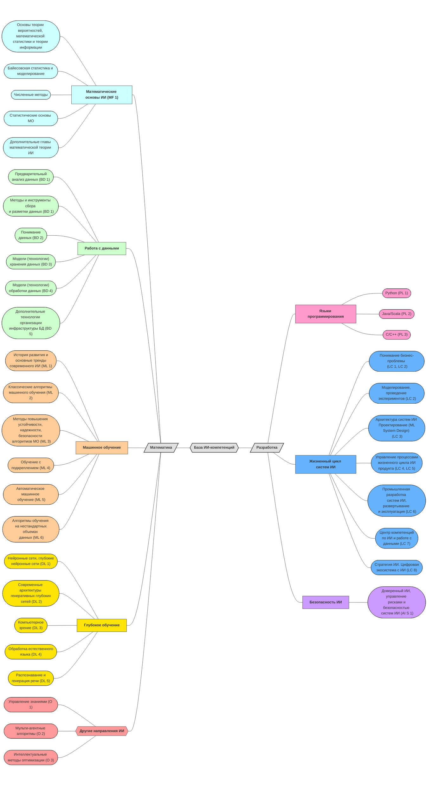

# Банк Компетенций
[**Таблица ролей**]()  
[**Краткая таблица компетенций профессий**]()
## Граф компетенций

```mermaid
graph LR;
classDef DomainStyle fill:#E0E0E0,stroke:#333,stroke-width:2px

classDef MathStyle fill:#CCFFFF,stroke:#333,stroke-width:1px
classDef BDStyle fill:#CCFFCC,stroke:#333,stroke-width:1px
classDef MLStyle fill:#FFCC99,stroke:#333,stroke-width:1px
classDef DLStyle fill:#FDE406,stroke:#333,stroke-width:1px
classDef OtherStyle fill:#FF9999,stroke:#333,stroke-width:1px

classDef PLStyle fill:#FF99CC,stroke:#333,stroke-width:1px
classDef LCStyle fill:#66B2FF,stroke:#333,stroke-width:1px
classDef AISStyle fill:#CC99FF,stroke:#333,stroke-width:1px

classDef WhiteSpace fill:#FFFFFF,stroke:#FFFFFF,stroke-width:1px

whiteSpace1[ ]:::WhiteSpace

aspectProbabilityStatistics(["Основы теории вероятностей, математической статистики и теории информации"]):::MathStyle ---areaMath["`**Математические основы ИИ (MF 1)**`"]:::MathStyle
aspectBayesStatistics(["Байесовская статистика и моделирование"]):::MathStyle ---areaMath
aspectNumericMethods(["Численные методы"]):::MathStyle ---areaMath
aspectMLStatistics(["Статистические основы МО"]):::MathStyle ---areaMath
aspectAdditionalAIMath(["Дополнительные главы математической теории ИИ"]):::MathStyle ---areaMath

aspectPreDataAnalysis(["Предварительный <br> анализ данных (BD 1)"]):::BDStyle ---areaBD["`**Работа с данными**`"]:::BDStyle
aspectDataMarkCollection(["Методы и инструменты сбора <br> и разметки данных (BD 1)"]):::BDStyle ---areaBD
aspectDataUnderstanding(["Понимание <br> данных (BD 2)"]):::BDStyle ---areaBD
aspectDataStoraging(["Модели (технологии) <br> хранения данных (BD 3)"]):::BDStyle ---areaBD
aspectDataProcessing(["Модели (технологии) <br> обработки данных (BD 4)"]):::BDStyle ---areaBD
aspectBDInfrastructure(["Дополнительные технологии <br> организации инфраструктуры БД (BD 5)"]):::BDStyle ---areaBD

aspectHistoryTrends(["История развития и <br> основные тренды <br> современного ИИ (ML 1)"]):::MLStyle ---areaML["`**Машинное обучение**`"]:::MLStyle
aspectClassicAlgo(["Классические алгоритмы <br> машинного обучения (ML 2)"]):::MLStyle ---areaML
aspectMLStability(["Методы повышения устойчивости, <br> надежности, безопасности <br> алгоритмов МО (ML 3)"]):::MLStyle ---areaML
aspectReinforcementLearning(["Обучение с <br> подкреплением (ML 4)"]):::MLStyle ---areaML
aspectAutoML(["Автоматическое машинное <br> обучение (ML 5)"]):::MLStyle ---areaML
aspectNonStandardLearningAlgo(["Алгоритмы обучения <br> на нестандартных объемах <br> данных (ML 6)"]):::MLStyle ---areaML

aspectDeepNeuro(["Нейронные сети, глубокие <br> нейронные сети (DL 1)"]):::DLStyle ---areaDL["`**Глубокое обучение**`"]:::DLStyle
aspectDeepNeuroArchitecture(["Современные архитектуры <br> генеративных глубоких <br> сетей (DL 2)"]):::DLStyle  ---areaDL
aspectComputerVision(["Компьютерное <br> зрение (DL 3)"]):::DLStyle ---areaDL
aspectLanguageProcessing(["Обработка естественного <br> языка (DL 4)"]):::DLStyle ---areaDL
aspectVoiceRecognition(["Распознавание и <br> генерация речи (DL 5)"]):::DLStyle ---areaDL

aspectKnowledgeManagement(["Управление знаниями (O 1)"]):::OtherStyle ---areaOther{{"`**Другие направления ИИ**`"}}:::OtherStyle
aspectMultiAgentAlgo(["Мульти-агентные алгоритмы (O 2)"]):::OtherStyle ---areaOther
aspectIntellectualOpti(["Интеллектуальные методы оптимизации (O 3)"]):::OtherStyle ---areaOther

whiteSpace[ ]:::WhiteSpace
whiteSpace[ ]:::WhiteSpace

areaMath ---domainMath[/"`**Математика**`"/]:::DomainStyle
areaBD ---domainMath
areaML ---domainMath
areaDL ---domainMath
areaOther ---domainMath

domainMath ---title{{"`**База ИИ-компетенций**`"}}:::DomainStyle

title ---domainDev[/"`**Разработка**`"/]:::DomainStyle

domainDev ---areaPL["`**Языки программирования**`"]:::PLStyle
domainDev ---areaLC["`**Жизненный цикл систем ИИ**`"]:::LCStyle
domainDev ---areaAIS["`**Безопасность ИИ**`"]:::AISStyle

areaPL ---aspectPython(["Python (PL 1)"]):::PLStyle
areaPL ---aspectJava(["Java/Scala (PL 2)"]):::PLStyle
areaPL ---aspectCPP(["C/C++ (PL 3)"]):::PLStyle

areaLC ---aspectBusinessProblem(["Понимание бизнес-проблемы <br> (LC 1, LC 2)"]):::LCStyle
areaLC ---aspectEXModeling(["Моделирование, проведение <br> экспериментов (LC 2)"]):::LCStyle
areaLC ---aspectAISysArchitecture(["Архитектура систем ИИ <br> Проектирование (ML System Design) <br> (LC 3)"]):::LCStyle
areaLC ---aspectLCControl(["Управление процессами <br> жизненного цикла ИИ <br> продукта (LC 4, LC 5)"]):::LCStyle
areaLC ---aspectIndustrialAI(["Промышленная разработка <br> систем ИИ, развертывание <br> и эксплуатация (LC 6)"]):::LCStyle
areaLC ---aspectAIDataCompetencies(["Центр компетенций <br> по ИИ и работе с <br> данными (LC 7)"]):::LCStyle
areaLC ---aspectStrategyEcoSystemAI(["Стратегия ИИ. Цифровая <br> экосистема с ИИ (LC 8)"]):::LCStyle

areaAIS ---aspectTrustedAI(["Доверенный ИИ, управление <br> рисками и безопасностью <br> систем ИИ (AI S 1)"]):::AISStyle


click aspectProbabilityStatistics "https://github.com/VoidSubjucator/Competence-Bank/blob/main/Math/AIMathBasics/aspectProbabilityStatistics.md"
click aspectBayesStatistics "https://github.com/VoidSubjucator/Competence-Bank/blob/main/Math/AIMathBasics/aspectBayesStatistics.md"
click aspectNumericMethods "https://github.com/VoidSubjucator/Competence-Bank/blob/main/Math/AIMathBasics/aspectNumericMethods.md"
click aspectMLStatistics "https://github.com/VoidSubjucator/Competence-Bank/blob/main/Math/AIMathBasics/aspectMLStatistics.md"
click aspectAdditionalAIMath "https://github.com/VoidSubjucator/Competence-Bank/blob/main/Math/AIMathBasics/aspectAdditionalAIMath.md"

click aspectPreDataAnalysis "https://github.com/VoidSubjucator/Competence-Bank/blob/main/Math/BD/aspectPreDataAnalysis.md"
click aspectDataMarkCollection "https://github.com/VoidSubjucator/Competence-Bank/blob/main/Math/BD/aspectDataMarkCollection.md"
click aspectDataUnderstanding "https://github.com/VoidSubjucator/Competence-Bank/blob/main/Math/BD/aspectDataUnderstanding.md"
click aspectDataStoraging "https://github.com/VoidSubjucator/Competence-Bank/blob/main/Math/BD/aspectDataStoraging.md"
click aspectDataProcessing "https://github.com/VoidSubjucator/Competence-Bank/blob/main/Math/BD/aspectDataProcessing.md"
click aspectBDInfrastructure "https://github.com/VoidSubjucator/Competence-Bank/blob/main/Math/BD/aspectBDInfrastructure.md"

click aspectHistoryTrends "https://github.com/VoidSubjucator/Competence-Bank/blob/main/Math/ML/aspectHistoryTrends.md"
click aspectClassicAlgo "https://github.com/VoidSubjucator/Competence-Bank/blob/main/Math/ML/aspectClassicAlgo.md"
click aspectMLStability "https://github.com/VoidSubjucator/Competence-Bank/blob/main/Math/ML/aspectMLStability.md"
click aspectReinforcementLearning "https://github.com/VoidSubjucator/Competence-Bank/blob/main/Math/ML/aspectReinforcementLearning.md"
click aspectAutoML "https://github.com/VoidSubjucator/Competence-Bank/blob/main/Math/ML/aspectAutoML.md"
click aspectNonStandardLearningAlgo "https://github.com/VoidSubjucator/Competence-Bank/blob/main/Math/ML/aspectNonStandardLearningAlgo.md"

click aspectDeepNeuro "https://github.com/VoidSubjucator/Competence-Bank/blob/main/Math/DL/aspectDeepNeuro.md"
click aspectDeepNeuroArchitecture "https://github.com/VoidSubjucator/Competence-Bank/blob/main/Math/DL/aspectDeepNeuroArchitecture.md"
click aspectComputerVision "https://github.com/VoidSubjucator/Competence-Bank/blob/main/Math/DL/aspectComputerVision.md"
click aspectLanguageProcessing "https://github.com/VoidSubjucator/Competence-Bank/blob/main/Math/DL/aspectLanguageProcessing.md"
click aspectVoiceRecognition "https://github.com/VoidSubjucator/Competence-Bank/blob/main/Math/DL/aspectVoiceRecognition.md"

click aspectKnowledgeManagement "https://github.com/VoidSubjucator/Competence-Bank/blob/main/Math/Other/aspectKnowledgeManagement.md"
click aspectMultiAgentAlgo "https://github.com/VoidSubjucator/Competence-Bank/blob/main/Math/Other/aspectMultiAgentAlgo.md"
click aspectIntellectualOpti "https://github.com/VoidSubjucator/Competence-Bank/blob/main/Math/Other/aspectIntellectualOpti.md"


click aspectPython "https://github.com/VoidSubjucator/Competence-Bank/blob/main/Dev/PL/aspectPython.md"
click aspectJava "https://github.com/VoidSubjucator/Competence-Bank/blob/main/Dev/PL/aspectJava.md"
click aspectCPP "https://github.com/VoidSubjucator/Competence-Bank/blob/main/Dev/PL/aspectCPP.md"

click aspectBusinessProblem "https://github.com/VoidSubjucator/Competence-Bank/blob/main/Dev/LC/aspectBusinessProblem.md"
click aspectEXModeling "https://github.com/VoidSubjucator/Competence-Bank/blob/main/Dev/LC/aspectEXModeling.md"
click aspectAISysArchitecture "https://github.com/VoidSubjucator/Competence-Bank/blob/main/Dev/LC/aspectAISysArchitecture.md"
click aspectLCControl "https://github.com/VoidSubjucator/Competence-Bank/blob/main/Dev/LC/aspectLCControl.md"
click aspectIndustrialAI "https://github.com/VoidSubjucator/Competence-Bank/blob/main/Dev/LC/aspectIndustrialAI.md"
click aspectAIDataCompetencies "https://github.com/VoidSubjucator/Competence-Bank/blob/main/Dev/LC/aspectAIDataCompetencies.md"
click aspectStrategyEcoSystemAI "https://github.com/VoidSubjucator/Competence-Bank/blob/main/Dev/LC/aspectStrategyEcoSystemAI.md"

click aspectTrustedAI "https://github.com/VoidSubjucator/Competence-Bank/blob/main/Dev/AIS/aspectTrustedAI.md"
```
