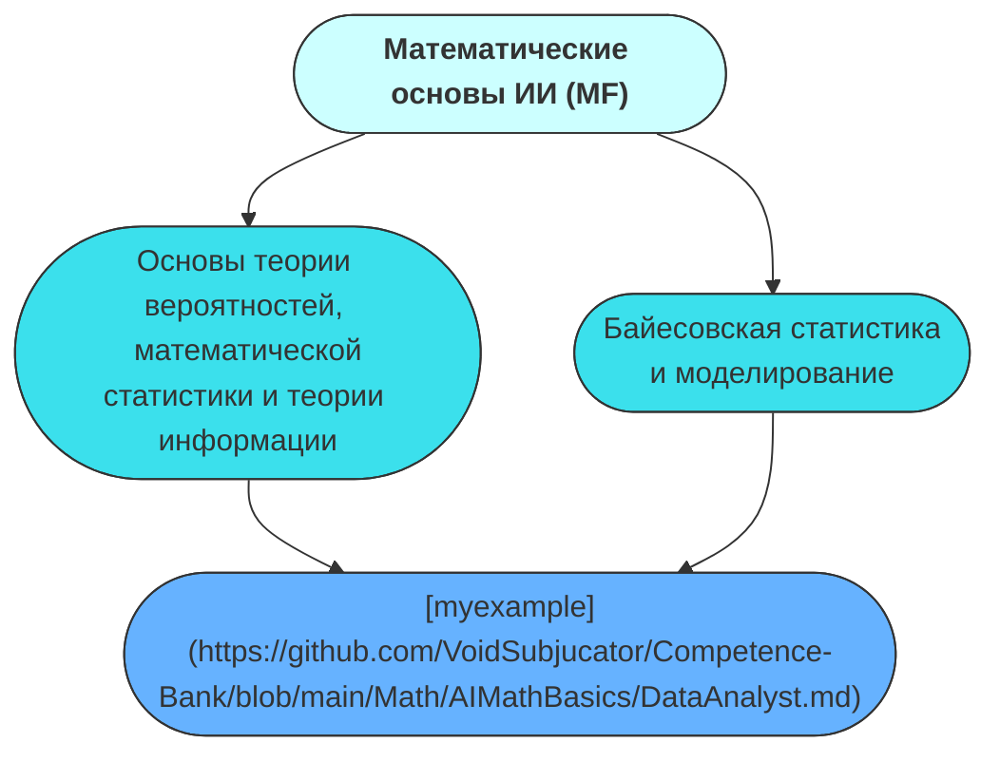

# Competence-Bank
## Математика

```mermaid
graph TD;


```
classDef areaMLStyle fill:#EBD48A,stroke:#333,stroke-width:1px
classDef areaDLStyle fill:#9F8C0F,stroke:#333,stroke-width:1px
classDef areaOtherStyle fill:#9F8C0F,stroke:#333,stroke-width:1px
classDef aspectMLStyle fill:#FFFF33,stroke:#333,stroke-width:1px
classDef aspectDLStyle fill:#FDE22E,stroke:#333,stroke-width:1px
classDef aspectOtherStyle fill:#FF6666,stroke:#333,stroke-width:1px
## Разработка

