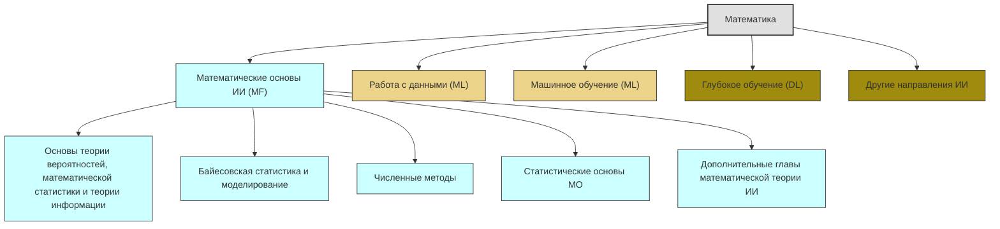

# Competence-Bank
## Математика

erDiagram
classDef domainStyle fill:#E0E0E0,stroke:#333,stroke-width:2px
classDef areaMathStyle fill:#CCFFFF,stroke:#333,stroke-width:1px
classDef areaMLStyle fill:#EBD48A,stroke:#333,stroke-width:1px
classDef areaDLStyle fill:#9F8C0F,stroke:#333,stroke-width:1px
classDef areaOtherStyle fill:#9F8C0F,stroke:#333,stroke-width:1px

classDef aspectMathStyle fill:#3399FF,stroke:#333,stroke-width:1px
classDef aspectMLStyle fill:#FFFF33,stroke:#333,stroke-width:1px
classDef aspectDLStyle fill:#FDE22E,stroke:#333,stroke-width:1px
classDef aspectOtherStyle fill:#FF6666,stroke:#333,stroke-width:1px

DomainMath["Математика"]:::domainStyle -->AreaMath["Математические основы ИИ (MF)"]:::areaMathStyle
DomainMath -->AreaDS["Работа с данными (ML)"]:::areaMLStyle
DomainMath -->AreaML["Машинное обучение (ML)"]:::areaMLStyle
DomainMath -->AreaDL["Глубокое обучение (DL)"]:::areaDLStyle
DomainMath -->AreaOther["Другие направления ИИ"]:::areaOtherStyle

AreaMath -->MathAspect1["Основы теории вероятностей, математической статистики и теории информации"]:::areaMathStyle
AreaMath -->MathAspect2["Байесовская статистика и моделирование"]:::areaMathStyle
AreaMath -->MathAspect3["Численные методы"]:::areaMathStyle
AreaMath -->MathAspect4["Статистические основы МО"]:::areaMathStyle
AreaMath -->MathAspect5["Дополнительные главы математической теории ИИ"]:::areaMathStyle
## Разработка

Идея:
Раздел - Математика (Домен)
Диаграмма:
  Область, код компетенции - ответвления направлений - ответвления профессий с ссылками на большие документы, в нем содержание таблицы 1 - ответвления тем, являющиеся ссылками на документ с описанием умений разных уровней

