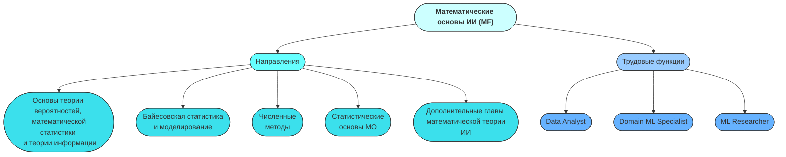

# Competence-Bank
## Математика

```mermaid
graph TD;
classDef areaMathStyle fill:#CCFFFF,stroke:#333,stroke-width:1px
classDef areasMath fill:#66FFFF,stroke:#333,stroke-width:1px
classDef jobsMath fill:#99CCFF,stroke:#333,stroke-width:1px
classDef aspectMathStyle fill:#3BE0EC,stroke:#333,stroke-width:1px
classDef jobsMathStyle fill:#66B2FF,stroke:#333,stroke-width:1px

AreaMath(["`**Математические основы ИИ (MF)**`"]):::areaMathStyle -->apectsMath(["Направления"]):::areasMath
apectsMath -->aspectProbabilityStatistics(["Основы теории вероятностей, <br> математической статистики <br> и теории информации"]):::aspectMathStyle
apectsMath -->aspectBayesStatistics(["Байесовская статистика <br> и моделирование"]):::aspectMathStyle
apectsMath -->aspectNumericMethods(["Численные <br> методы"]):::aspectMathStyle
apectsMath -->aspectMLStatistics(["Статистические <br> основы МО"]):::aspectMathStyle
apectsMath -->aspectAdditionalAIMath(["Дополнительные главы <br> математической теории ИИ"]):::aspectMathStyle

AreaMath -->jobsMath(["Трудовые функции"]):::jobsMath
jobsMath -->MathJobsDataAnalyst(["Data Analyst"]):::jobsMathStyle
jobsMath -->MathJobsDomainMLSpecialist(["Domain ML Specialist"]):::jobsMathStyle
jobsMath -->MathJobsMLResearcher(["ML Researcher"]):::jobsMathStyle

click aspectProbabilityStatistics "https://github.com/VoidSubjucator/Competence-Bank/blob/main/Math/AIMathBasics/aspectProbabilityStatistics.md"
click aspectBayesStatistics "https://github.com/VoidSubjucator/Competence-Bank/blob/main/Math/AIMathBasics/aspectBayesStatistics.md"
click aspectNumericMethods "https://github.com/VoidSubjucator/Competence-Bank/blob/main/Math/AIMathBasics/aspectNumericMethods.md"
click aspectMLStatistics "https://github.com/VoidSubjucator/Competence-Bank/blob/main/Math/AIMathBasics/aspectMLStatistics.md"
click aspectAdditionalAIMath "https://github.com/VoidSubjucator/Competence-Bank/blob/main/Math/AIMathBasics/aspectAdditionalAIMath.md"

click MathJobsDataAnalyst "https://github.com/VoidSubjucator/Competence-Bank/blob/main/Math/AIMathBasics/jobDataAnalyst.md" _blank
click MathJobsDomainMLSpecialist "https://github.com/VoidSubjucator/Competence-Bank/blob/main/Math/AIMathBasics/jobDomainMLSpecialist.md" _blank
click MathJobsMLResearcher "https://github.com/VoidSubjucator/Competence-Bank/blob/main/Math/AIMathBasics/jobMLResearcher.md" _blank
```

```mermaid
graph TD;
classDef BD1Style fill:#CCFFCC,stroke:#333,stroke-width:1px
classDef BD2Style fill:#99FF99,stroke:#333,stroke-width:1px
classDef BD3Style fill:#66FF66,stroke:#333,stroke-width:1px
classDef BD4Style fill:#80FF00,stroke:#333,stroke-width:1px
classDef BD5Style fill:#00CC00,stroke:#333,stroke-width:1px

areaBD(["`**Работа с данными**`"]):::BD1Style -->aspectPreDataAnalysis(["Предварительный <br> анализ данных (BD 1)"]):::BD1Style
areaBD -->aspectDataMarkCollection(["Методы и инструменты сбора <br> и разметки данных (BD 1)"]):::BD1Style
areaBD -->aspectDataUnderstanding(["Понимание <br> данных (BD 2)"]):::BD2Style
areaBD -->aspectDataStoraging(["Модели (технологии) <br> хранения данных (BD 3)"]):::BD3Style
areaBD -->aspectDataProcessing(["Модели (технологии) <br> обработки данных (BD 4)"]):::BD4Style
areaBD -->aspectBDInfrastructure(["Дополнительные технологии <br> организации инфраструктуры БД (BD 5)"]):::BD5Style

aspectPreDataAnalysis -->jobsDataEngineer(["Data Engineer"]):::BD1Style
aspectDataMarkCollection -->jobsDataEngineer

aspectDataUnderstanding -->jobsDataAnalyst(["Data <br> Analyst"]):::BD2Style
aspectDataUnderstanding -->jobsAIPM(["AI PM"]):::BD2Style
aspectDataUnderstanding -->jobsDomainMLSpecialist(["Domain ML <br> Specialist"]):::BD2Style

aspectDataUnderstanding -->jobsDataEngineer3(["Data <br> Engineer"]):::BD3Style
aspectDataStoraging -->jobsDataArchitect(["Data <br> Architect"]):::BD3Style
aspectDataStoraging -->jobsDataEngineer3(["Data <br> Engineer"]):::BD3Style

aspectDataProcessing -->jobsDataEngineer4(["Data Engineer"]):::BD5Style
aspectBDInfrastructure -->jobsDataEngineer4

click jobsDataEngineer "https://github.com/VoidSubjucator/Competence-Bank/blob/main/Math/BD/jobDataEngineer.md"
click jobsDataEngineer3 "https://github.com/VoidSubjucator/Competence-Bank/blob/main/Math/BD/jobDataEngineer.md"
click jobsDataEngineer4 "https://github.com/VoidSubjucator/Competence-Bank/blob/main/Math/BD/jobDataEngineer.md"

click jobsDataAnalyst "https://github.com/VoidSubjucator/Competence-Bank/blob/main/Math/AIMathBasics/jobDataAnalyst.md"
click jobsAIPM "https://github.com/VoidSubjucator/Competence-Bank/blob/main/Math/BD/jobAIPM.md"
click jobsDomainMLSpecialist "https://github.com/VoidSubjucator/Competence-Bank/blob/main/Math/AIMathBasics/jobDataAnalyst.md"

click jobsDataArchitect "https://github.com/VoidSubjucator/Competence-Bank/blob/main/Math/BD/jobDataArchitect.md"
```

## Разработка

