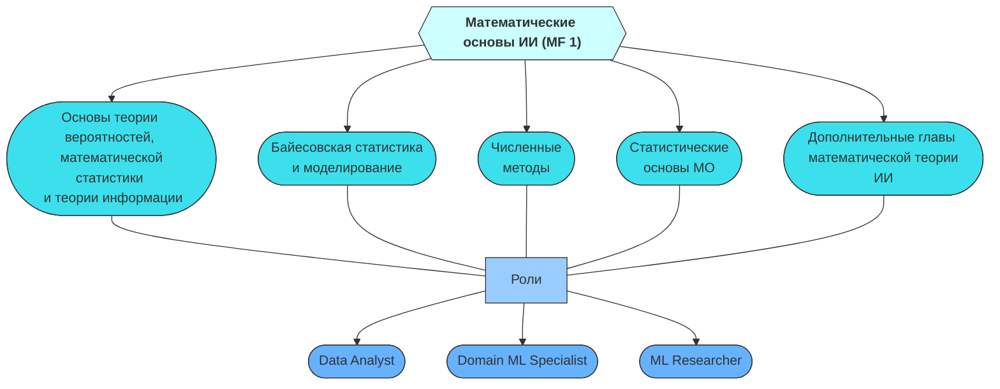
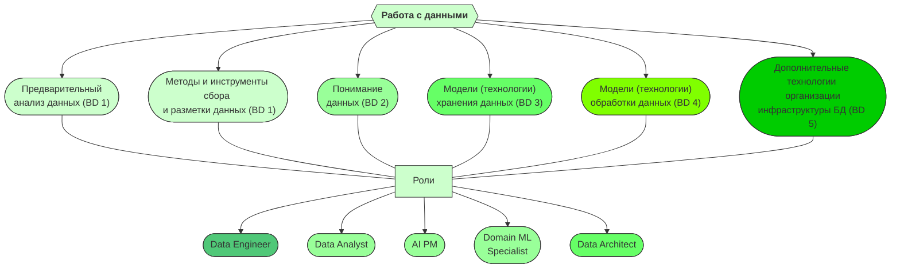
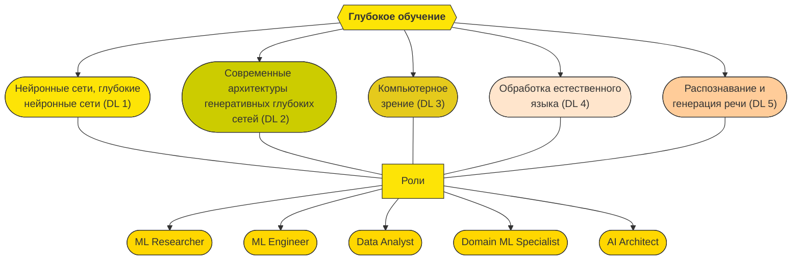
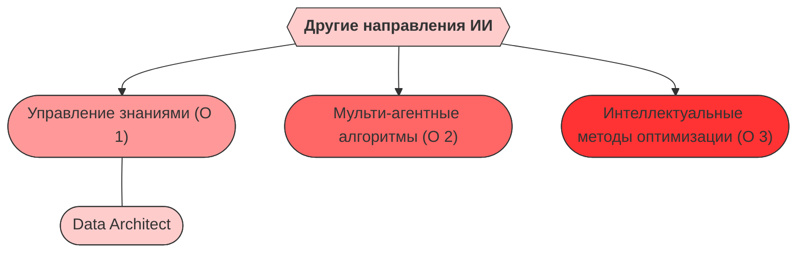
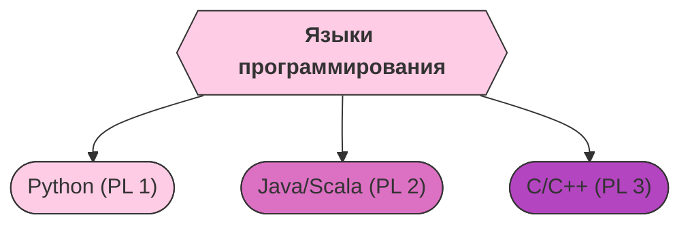

# Банк Компетенций
## Математика

```mermaid
graph TD;
classDef areaMathStyle fill:#CCFFFF,stroke:#333,stroke-width:1px
classDef areasMath fill:#66FFFF,stroke:#333,stroke-width:1px
classDef jobMath fill:#99CCFF,stroke:#333,stroke-width:1px
classDef aspectMathStyle fill:#3BE0EC,stroke:#333,stroke-width:1px
classDef jobMathStyle fill:#66B2FF,stroke:#333,stroke-width:1px

AreaMath{{"`**Математические основы ИИ (MF 1)**`"}}:::areaMathStyle -->aspectProbabilityStatistics(["Основы теории вероятностей, <br> математической статистики <br> и теории информации"]):::aspectMathStyle
AreaMath -->aspectBayesStatistics(["Байесовская статистика <br> и моделирование"]):::aspectMathStyle
AreaMath -->aspectNumericMethods(["Численные <br> методы"]):::aspectMathStyle
AreaMath -->aspectMLStatistics(["Статистические <br> основы МО"]):::aspectMathStyle
AreaMath -->aspectAdditionalAIMath(["Дополнительные главы <br> математической теории ИИ"]):::aspectMathStyle

aspectProbabilityStatistics ---jobsMath["Роли"]:::jobMath
aspectBayesStatistics ---jobsMath
aspectNumericMethods ---jobsMath
aspectMLStatistics ---jobsMath
aspectAdditionalAIMath ---jobsMath

jobsMath -->MathJobDataAnalyst(["Data Analyst"]):::jobMathStyle
jobsMath -->MathJobDomainMLSpecialist(["Domain ML Specialist"]):::jobMathStyle
jobsMath -->MathJobMLResearcher(["ML Researcher"]):::jobMathStyle

click aspectProbabilityStatistics "https://github.com/VoidSubjucator/Competence-Bank/blob/main/Math/AIMathBasics/aspectProbabilityStatistics.md"
click aspectBayesStatistics "https://github.com/VoidSubjucator/Competence-Bank/blob/main/Math/AIMathBasics/aspectBayesStatistics.md"
click aspectNumericMethods "https://github.com/VoidSubjucator/Competence-Bank/blob/main/Math/AIMathBasics/aspectNumericMethods.md"
click aspectMLStatistics "https://github.com/VoidSubjucator/Competence-Bank/blob/main/Math/AIMathBasics/aspectMLStatistics.md"
click aspectAdditionalAIMath "https://github.com/VoidSubjucator/Competence-Bank/blob/main/Math/AIMathBasics/aspectAdditionalAIMath.md"

click MathJobDataAnalyst "https://github.com/VoidSubjucator/Competence-Bank/blob/main/Jobs/jobDataAnalyst.md" _blank
click MathJobDomainMLSpecialist "https://github.com/VoidSubjucator/Competence-Bank/blob/main/Jobs/jobDomainMLSpecialist.md" _blank
click MathJobMLResearcher "https://github.com/VoidSubjucator/Competence-Bank/blob/main/Jobs/jobMLResearcher.md" _blank
```

```mermaid
graph TD;
classDef BD1Style fill:#CCFFCC,stroke:#333,stroke-width:1px
classDef BD2Style fill:#99FF99,stroke:#333,stroke-width:1px
classDef BD3Style fill:#66FF66,stroke:#333,stroke-width:1px
classDef BD4Style fill:#80FF00,stroke:#333,stroke-width:1px
classDef BD5Style fill:#00CC00,stroke:#333,stroke-width:1px
classDef BDJobsStyle fill:#50c878,stroke:#333,stroke-width:1px

areaBD{{"`**Работа с данными**`"}}:::BD1Style -->aspectPreDataAnalysis(["Предварительный <br> анализ данных (BD 1)"]):::BD1Style
areaBD -->aspectDataMarkCollection(["Методы и инструменты сбора <br> и разметки данных (BD 1)"]):::BD1Style
areaBD -->aspectDataUnderstanding(["Понимание <br> данных (BD 2)"]):::BD2Style
areaBD -->aspectDataStoraging(["Модели (технологии) <br> хранения данных (BD 3)"]):::BD3Style
areaBD -->aspectDataProcessing(["Модели (технологии) <br> обработки данных (BD 4)"]):::BD4Style
areaBD -->aspectBDInfrastructure(["Дополнительные технологии <br> организации инфраструктуры БД (BD 5)"]):::BD5Style

aspectPreDataAnalysis ---BDJobs["Роли"]:::BD1Style
aspectDataMarkCollection ---BDJobs
aspectDataUnderstanding ---BDJobs
aspectDataStoraging ---BDJobs
aspectDataProcessing ---BDJobs
aspectBDInfrastructure ---BDJobs

BDJobs -->jobDataEngineer(["Data Engineer"]):::BDJobsStyle
BDJobs -->jobDataAnalyst(["Data Analyst"]):::BD2Style
BDJobs -->jobAIPM(["AI PM"]):::BD2Style
BDJobs -->jobDomainMLSpecialist(["Domain ML <br> Specialist"]):::BD2Style
BDJobs -->jobDataArchitect(["Data Architect"]):::BD3Style

click aspectPreDataAnalysis "https://github.com/VoidSubjucator/Competence-Bank/blob/main/Math/BD/aspectPreDataAnalysis.md"
click aspectDataMarkCollection "https://github.com/VoidSubjucator/Competence-Bank/blob/main/Math/BD/aspectDataMarkCollection.md"
click aspectDataUnderstanding "https://github.com/VoidSubjucator/Competence-Bank/blob/main/Math/BD/aspectDataUnderstanding.md"
click aspectDataStoraging "https://github.com/VoidSubjucator/Competence-Bank/blob/main/Math/BD/aspectDataStoraging.md"
click aspectDataProcessing "https://github.com/VoidSubjucator/Competence-Bank/blob/main/Math/BD/aspectDataProcessing.md"
click aspectBDInfrastructure "https://github.com/VoidSubjucator/Competence-Bank/blob/main/Math/BD/aspectBDInfrastructure.md"

click jobDataEngineer "https://github.com/VoidSubjucator/Competence-Bank/blob/main/Jobs/jobDataEngineer.md"
click jobDataAnalyst "https://github.com/VoidSubjucator/Competence-Bank/blob/main/Jobs/jobDataAnalyst.md"
click jobAIPM "https://github.com/VoidSubjucator/Competence-Bank/blob/main/Jobs/jobAIPM.md"
click jobDomainMLSpecialist "https://github.com/VoidSubjucator/Competence-Bank/blob/main/Jobs/jobDomainMLSpecialist.md"
click jobDataArchitect "https://github.com/VoidSubjucator/Competence-Bank/blob/main/Jobs/jobDataArchitect.md"
```

```mermaid
graph TD;
classDef ML1Style fill:#FFCC99,stroke:#333,stroke-width:1px
classDef ML2Style fill:#FFF999,stroke:#333,stroke-width:1px
classDef ML3Style fill:#FFF666,stroke:#333,stroke-width:1px
classDef ML4Style fill:#FFB266,stroke:#333,stroke-width:1px
classDef ML5Style fill:#FF9933,stroke:#333,stroke-width:1px
classDef ML6Style fill:#CC6600,stroke:#333,stroke-width:1px
classDef MLJobStyle fill:#FFFFCC,stroke:#333,stroke-width:1px

areaML{{"`**Машинное обучение**`"}}:::ML1Style -->aspectHistoryTrends(["История развития и <br> основные тренды <br> современного ИИ (ML 1)"]):::ML1Style
areaML -->aspectClassicAlgo(["Классические алгоритмы <br> машинного обучения (ML 2)"]):::ML2Style
areaML -->aspectMLStability(["Методы повышения устойчивости, <br> надежности, безопасности <br> алгоритмов МО (ML 3)"]):::ML3Style
areaML -->aspectReinforcementLearning(["Обучение с <br> подкреплением (ML 4)"]):::ML4Style
areaML -->aspectAutoML(["Автоматическое машинное <br> обучение (ML 5)"]):::ML5Style
areaML -->aspectNonStandardLearningAlgo(["Алгоритмы обучения <br> на нестандартных объемах <br> данных (ML 6)"]):::ML6Style

aspectHistoryTrends ---jobsHeaderML["Роли"]:::ML1Style
aspectClassicAlgo ---jobsHeaderML
aspectMLStability ---jobsHeaderML
aspectReinforcementLearning ---jobsHeaderML
aspectAutoML ---jobsHeaderML
aspectNonStandardLearningAlgo ---jobsHeaderML

jobsHeaderML -->jobAIArchitect(["AI Architect"]):::MLJobStyle
jobsHeaderML -->jobMLResearcher(["ML Researcher"]):::MLJobStyle
jobsHeaderML -->jobMLEngineer(["ML Engineer"]):::MLJobStyle
jobsHeaderML -->jobDataAnalyst(["Data Analyst"]):::MLJobStyle
jobsHeaderML -->jobDomainMLSpecialist(["Domain ML Specialist"]):::MLJobStyle

click aspectHistoryTrends "https://github.com/VoidSubjucator/Competence-Bank/blob/main/Math/ML/aspectHistoryTrends.md"
click aspectClassicAlgo "https://github.com/VoidSubjucator/Competence-Bank/blob/main/Math/ML/aspectClassicAlgo.md"
click aspectMLStability "https://github.com/VoidSubjucator/Competence-Bank/blob/main/Math/ML/aspectMLStability.md"
click aspectReinforcementLearning "https://github.com/VoidSubjucator/Competence-Bank/blob/main/Math/ML/aspectReinforcementLearning.md"
click aspectAutoML "https://github.com/VoidSubjucator/Competence-Bank/blob/main/Math/ML/aspectAutoML.md"
click aspectNonStandardLearningAlgo "https://github.com/VoidSubjucator/Competence-Bank/blob/main/Math/ML/aspectNonStandardLearningAlgo.md"

click jobAIArchitect "https://github.com/VoidSubjucator/Competence-Bank/blob/main/Jobs/jobAIArchitect.md"
click jobMLResearcher "https://github.com/VoidSubjucator/Competence-Bank/blob/main/Jobs/jobMLResearcher.md"
click jobMLEngineer "https://github.com/VoidSubjucator/Competence-Bank/blob/main/Jobs/jobMLEngineer.md"
click jobDataAnalyst "https://github.com/VoidSubjucator/Competence-Bank/blob/main/Jobs/jobDataAnalyst.md"
click jobDomainMLSpecialist "https://github.com/VoidSubjucator/Competence-Bank/blob/main/Jobs/jobDomainMLSpecialist.md"
```

```mermaid
graph TD;
classDef DL1Style fill:#FDE406,stroke:#333,stroke-width:1px
classDef DL2Style fill:#CCCC00,stroke:#333,stroke-width:1px
classDef DL3Style fill:#E5CA1C,stroke:#333,stroke-width:1px
classDef DL4Style fill:#FFE5CC,stroke:#333,stroke-width:1px
classDef DL5Style fill:#FFCC99,stroke:#333,stroke-width:1px
classDef DLJobStyle fill:#ffd700,stroke:#333,stroke-width:1px

areaDL{{"`**Глубокое обучение**`"}}:::DL1Style -->aspectDeepNeuro(["Нейронные сети, глубокие <br> нейронные сети (DL 1)"]):::DL1Style
areaDL -->aspectDeepNeuroArchitecture(["Современные архитектуры <br> генеративных глубоких <br> сетей (DL 2)"]):::DL2Style
areaDL -->aspectComputerVision(["Компьютерное <br> зрение (DL 3)"]):::DL3Style
areaDL -->aspectLanguageProcessing(["Обработка естественного <br> языка (DL 4)"]):::DL4Style
areaDL -->aspectVoiceRecognition(["Распознавание и <br> генерация речи (DL 5)"]):::DL5Style

aspectDeepNeuro ---jobsHeaderDL["Роли"]:::DL1Style
aspectDeepNeuroArchitecture ---jobsHeaderDL
aspectComputerVision ---jobsHeaderDL
aspectLanguageProcessing ---jobsHeaderDL
aspectVoiceRecognition ---jobsHeaderDL

jobsHeaderDL -->jobMLResearcher(["ML Researcher"]):::DLJobStyle
jobsHeaderDL -->jobMLEngineer(["ML Engineer"]):::DLJobStyle
jobsHeaderDL -->jobDataAnalyst(["Data Analyst"]):::DLJobStyle
jobsHeaderDL -->jobDomainMLSpecialist(["Domain ML Specialist"]):::DLJobStyle
jobsHeaderDL -->jobAIArchitect(["AI Architect"]):::DLJobStyle

click aspectDeepNeuro "https://github.com/VoidSubjucator/Competence-Bank/blob/main/Math/DL/aspectDeepNeuro.md"
click aspectDeepNeuroArchitecture "https://github.com/VoidSubjucator/Competence-Bank/blob/main/Math/DL/aspectDeepNeuroArchitecture.md"
click aspectComputerVision "https://github.com/VoidSubjucator/Competence-Bank/blob/main/Math/DL/aspectComputerVision.md"
click aspectLanguageProcessing "https://github.com/VoidSubjucator/Competence-Bank/blob/main/Math/DL/aspectLanguageProcessing.md"
click aspectVoiceRecognition "https://github.com/VoidSubjucator/Competence-Bank/blob/main/Math/DL/aspectVoiceRecognition.md"

click jobMLResearcher "https://github.com/VoidSubjucator/Competence-Bank/blob/main/Jobs/jobMLResearcher.md"
click jobMLEngineer "https://github.com/VoidSubjucator/Competence-Bank/blob/main/Jobs/jobMLEngineer.md"
click jobDataAnalyst "https://github.com/VoidSubjucator/Competence-Bank/blob/main/Jobs/jobDataAnalyst.md"
click jobDomainMLSpecialist "https://github.com/VoidSubjucator/Competence-Bank/blob/main/Jobs/jobDomainMLSpecialist.md"
click jobAIArchitect "https://github.com/VoidSubjucator/Competence-Bank/blob/main/Jobs/jobAIArchitect.md"
```

```mermaid
graph TD;
classDef O1Style fill:#FFCCCC,stroke:#333,stroke-width:1px
classDef O2Style fill:#FF9999,stroke:#333,stroke-width:1px
classDef O3Style fill:#FF6666,stroke:#333,stroke-width:1px
classDef O4Style fill:#FF3333,stroke:#333,stroke-width:1px

areaO{{"`**Другие направления ИИ**`"}}:::O1Style -->aspectKnowledgeManagement(["Управление знаниями (O 1)"]):::O2Style
areaO -->aspectMultiAgentAlgo(["Мульти-агентные алгоритмы (O 2)"]):::O3Style
areaO -->aspectIntellectualOpti(["Интеллектуальные методы оптимизации (O 3)"]):::O4Style

aspectKnowledgeManagement ---jobDataArchitect(["Data Architect"]):::O1Style

click aspectKnowledgeManagement "https://github.com/VoidSubjucator/Competence-Bank/blob/main/Math/Other/aspectKnowledgeManagement.md"
click aspectMultiAgentAlgo "https://github.com/VoidSubjucator/Competence-Bank/blob/main/Math/Other/aspectMultiAgentAlgo.md"
click aspectIntellectualOpti "https://github.com/VoidSubjucator/Competence-Bank/blob/main/Math/Other/aspectIntellectualOpti.md"

click jobDataArchitect "https://github.com/VoidSubjucator/Competence-Bank/blob/main/Jobs/jobDataArchitect.md"
```

## Разработка

```mermaid
graph TD;
classDef PL1Style fill:#FFCCE5,stroke:#333,stroke-width:1px
classDef PL2Style fill:#DC71C3,stroke:#333,stroke-width:1px
classDef PL3Style fill:#B445C0,stroke:#333,stroke-width:1px

areaPL{{"`**Языки программирования**`"}}:::PL1Style -->aspectPython(["Python (PL 1)"]):::PL1Style
areaPL -->aspectJavaScala(["Java/Scala (PL 2)"]):::PL2Style
areaPL -->aspectCPP(["C/C++ (PL 3)"]):::PL3Style

click aspectPython "https://github.com/VoidSubjucator/Competence-Bank/blob/main/Dev/PL/aspectPython.md"
click aspectJava "https://github.com/VoidSubjucator/Competence-Bank/blob/main/Dev/PL/aspectJava.md"
click aspectCPP "https://github.com/VoidSubjucator/Competence-Bank/blob/main/Dev/PL/aspectCPP.md"
```
